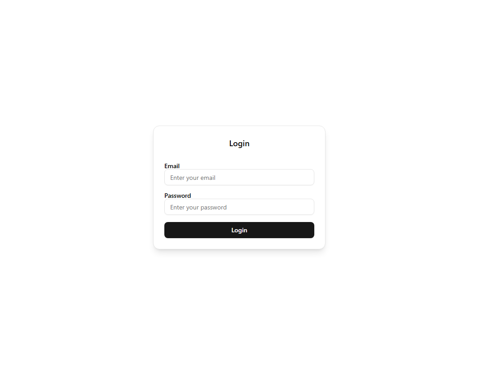
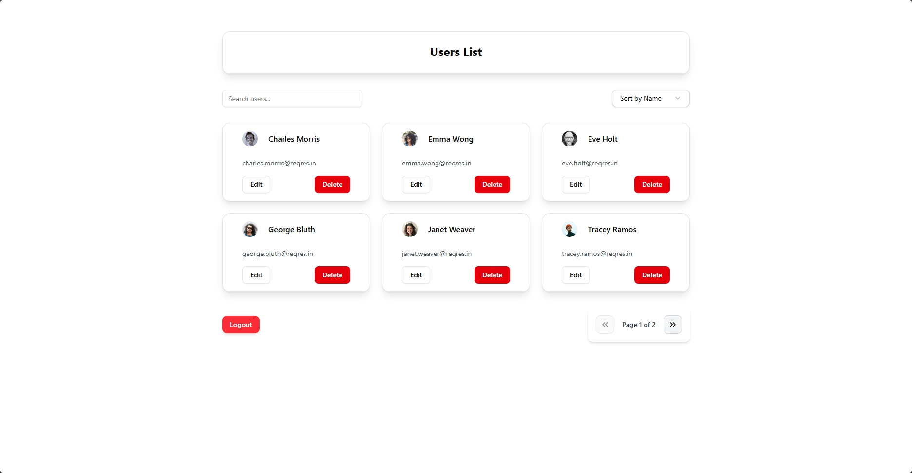

# Reqres User Manager
A React application that integrates with the Reqres API to perform basic user management functions, including authentication, user listing, editing, and deletion.

## Features

### Level 1: Authentication

- Users can log in with the following credentials:
  - **Email:** eve.holt@reqres.in
  - **Password:** cityslicka
- On successful login, a token is stored in **localStorage**, and the user is redirected to the user list.

### Level 2: User List

- Fetches users from **GET /api/users?page=1** endpoint.
- Displays users in a structured format with **name, email, and avatar**.
- Implements **pagination** for easy navigation.
- Allows **client-side search and sorting**.

### Level 3: Edit & Delete Users

- **Edit**: Users can update their first name, last name, and email using **PUT /api/users/{id}**.
- **Delete**: Users can be removed using **DELETE /api/users/{id}**, and the list updates instantly.

## Tech Stack

```bash
- React (Frontend framework)
- Context API (Global state management)
- Axios (For API requests)
- ShadCN UI (For styling)
- React Router (For navigation)
```

## Installation

1. Clone the Repository

git clone https://github.com/GauravOP-03/EmployWise-Assignment.git
cd EmployWise-Assignment

2. Install Dependencies

npm install

3. Run the Application

npm run dev

## Usage

- Navigate to http://localhost:5173
- Log in using the provided credentials.
- Manage users from the dashboard (search, edit, delete, and paginate).

## Api Endpoint Used

- POST /api/login → Authentication
- GET /api/users?page=1 → Fetch users
- PUT /api/users/{id} → Update user
- DELETE /api/users/{id} → Delete user

## Bonus Features

- Client-side filtering & sorting
- Persistent login using localStorage
- Deployed version available at: [EmployWise - Live App](https://employwise-assesment.onrender.com/login)

## Screenshots


### Login Page


### User Dashboard


### Edit Page
